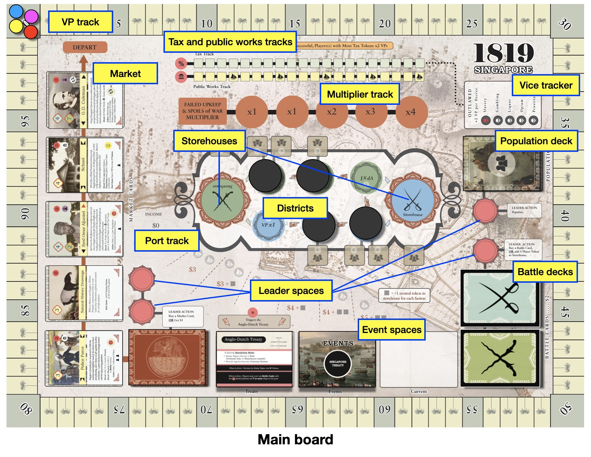
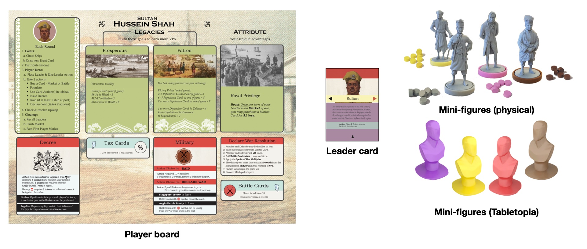
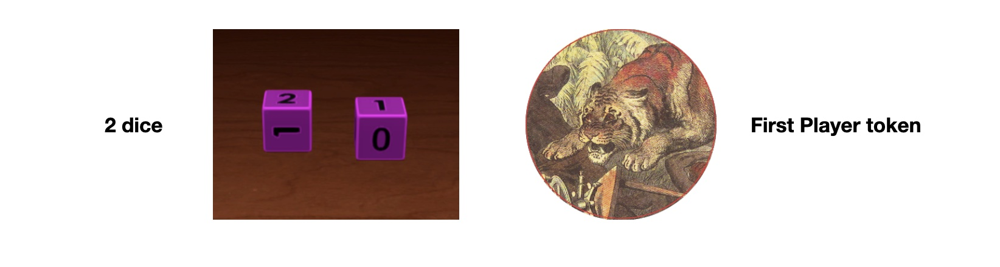

# Setup

This setup is for Fantasy Mode. We recommend your first game be in Fantasy Mode.

- To set up Simulation Mode, follow steps A to G below, then carry out the modified steps [here](simulation-mode#setup-changes).
- To play a game without depictions of slavery, refer to [Playing without slavery](#playing-without-slavery).
- For Tabletopia setup, see [Tabletopia setup](#tabletopia-setup).

## Player Setup

### A. Boards, Leader cards and mini-figures

Hand each player a board, Leader card, and corresponding mini-figure. For your first game, use the illustrated side of the player board.

<!-- Players on the same faction sit beside each other. -->
<!-- Leader spaces give players Leader Actions that reflect their priorities for the round. -->

<!-- ### B. Legacy and Attribute tiles -->
<!-- Legacies are the achievements your character wants history to remember them for, while Attributes allow them to bend the rules *(ever so slightly)* in their favor. -->
<!-- 
For your first game, use the Legacies and Attributes printed on the player boards. Put the Legacy and Attribute tiles away.

Otherwise, have each player draw 3 Legacy tiles at random, keep 2, and discard the other. Also have each player draw 1 Attribute tile at random. Put the rest of the tiles away. -->

### B. Player tokens

Hand each player a set of colored tokens. Have each player place 1 token on the zero space of the Victory Point track.

On the board, player tokens represent Influence. Filling Districts with Influence earns you VPs. Spending Influence from your faction Storehouse lets you issue Decrees or declare War.

Off the board, player tokens are also used as trackers for Legacies and the like.

### C. Dice and First Player token

*1819* is played with a pair of dice ("2D"), each with values {0, 1, 2}.

Hand the player who rolls the highest on 2D, the First Player token.

## Board Setup

### D. Districts

Cover the x2 and x3 Districts with the four black markers. These Districts are closed; they must be Populated before players can place Influence tokens on them.

<!-- Cover the Leader space marked with &#9733;&#9733; with the corresponding black marker. This Leader space is closed; eleven Ships must enter the Port before it opens. -->

<!-- > *3-player game: the solo player only covers their x3 District.* -->
<!-- ## Card Setup -->

### E. Event cards

Separate the Event cards by their backs: Event I, Event II, and the Treaties.

- Shuffle the Event II cards, then deal 4 face down onto the Events space.
- Then shuffle the Event I cards and deal 3 face down on top of the Event II cards.
- Place the Anglo-Dutch Treaty **face up** on the Treaty space.
- Place the Singapore Treaty **face up** on top of the Anglo-Dutch Treaty.

Put the rest of the Event cards away.

### F. Market cards

Shuffle the Market deck and place it face down on the appropriate space. Deal the first 5 cards face up onto the Market from right to left.

### G. Population cards

Shuffle the Population deck and place it face down on the appropriate space. Population cards yield Population cubes, which unlock higher-scoring Districts.

Off the board, Population cubes are also used as Neutral tokens.

<!-- 
represent the various social groups who migrated---voluntarily or otherwise---into Singapore.
 -->

### H. Battle cards

Shuffle each faction's Battle deck and place them face down on the appropriate spaces. Have each player draw 1 card from their faction deck.

<!-- 
> *3-player game: the solo player draws 3 Battle cards and keeps 2.*
 -->

## Setup is complete!

***

### Playing without slavery
*1819* contains two cards that represent common kinds of slavery practiced in 19th-century Malacca.

**Players may remove these two cards without greatly affecting gameplay.**

*Later on, we will write a more in-depth discussion of slavery in early colonial Singapore that may better illuminate our decision to include these cards. For now, suffice to say that we include these cards in support of some of our cornerstone historical arguments:*
- *that early Singapore was funded, in no small part, through the production of goods we might call vices today, using labor practices considered exploitative even at the time;*
- *that the practices and motivations for slavery in 19th-century Malacca were different from the Transatlantic context, as were the pathways to its criminalization and slave emancipation; and*
- *that the British outlawing of vices and exploitative labor practices was strategic more than moral, and more often than not in favor of entrenching its colonial powers at the expense of local leaders.*

### Tabletopia setup
On Tabletopia, most setup is done for you. Select the Mode you wish to play, then:
- determine the First Player and hand them the token;
- shuffle Slavery cards into the Market (if you wish);
- draw Battle cards; and
- stack the Event cards.

On your first round, Event and Income have been settled for you. Proceed to [Take Player turns](sequence-of-play#3-take-player-turns).