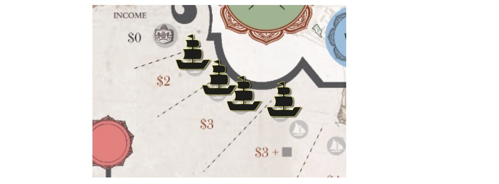
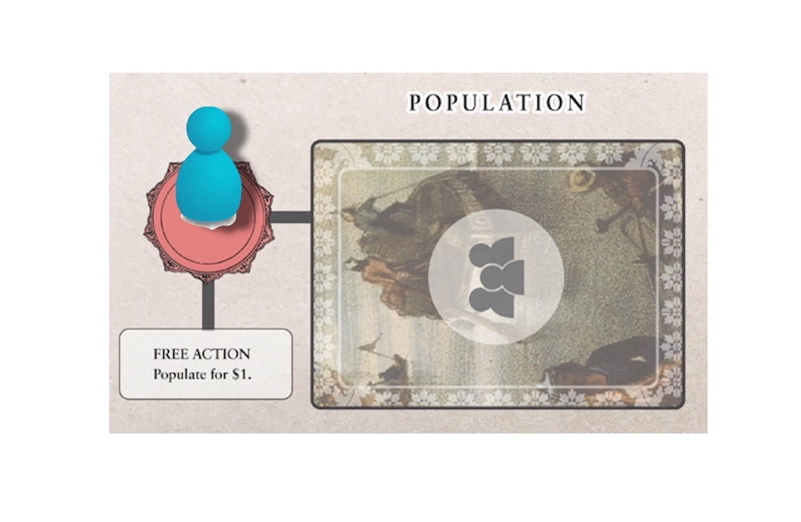
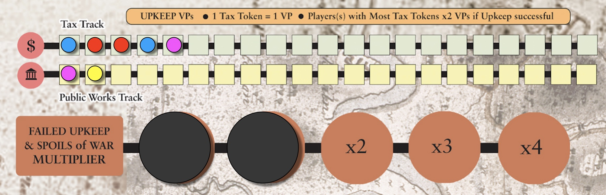

## Game Flow

1819 Singapore is played over a series of eight rounds or fewer. Each round proceeds as follows:
1. [Events](#1-events);
2. [Distribute Income](#2-distribute-income);
3. [Take Player turns](#3-take-player-turns);
4. [Perform Upkeep](#4-perform-upkeep); and
5. [Cleanup](#5-cleanup).

## 1. Events

### a. Check Ships
- In the first round, skip this step.
- In succeeding rounds, count the Ships in the Port.
    - If there are **at least seven** Ships, discard the Singapore Treaty.
    - The Anglo-Dutch Treaty is now in effect.

*Note: Once the Anglo-Dutch Treaty is signed, skip this step going forward---the Treaty cannot be unsigned!*

### b. Draw new Event card
- In the first round, reveal the Singapore Treaty onto the Treaty space. Add two Ships to the Port.
- In succeeding rounds, reveal the top Event card onto the Current space. Resolve any [instant effects](important-concepts#instant-effects) before proceeding.

*Note: The effects of the Anglo-Dutch Treaty are public knowledge---players may refer to the card even while covered by the Singapore Treaty.*

Also see [Events](events).

## 2. Distribute Income

- In the first round, hand each player $3.
- In succeeding rounds, distribute Income and tokens as specified by the highest occupied Port space.

> *Example.* There are four Ships on the Port track. Hand each player $3, and place one Neutral token in each Storehouse.

## 3. Take Player turns
Play proceeds clockwise from the First Player. On your turn, do the following:

### a. Place Leader
Place your mini-figure on an open Leader space. Take the indicated Leader Action, if feasible and desired. Leader Actions **may not be taken later**!

<!-- For your first game, place the corresponding mini-figures on their starting Leader spaces:

| Mini-figure | Starting Leader space |
| :---: | :---: |
| Governor | Market |
| Resident | Market |
| Temenggong | Battle |
| Sultan | Population | -->

### b. Take two Actions and any Free Actions
The Core Actions are:

- **Buy** a Market or Battle card
- **Populate** Singapore with a Population card
- **Activate** a card or community
- Go on a **Raid**
- Issue a **Decree**
- Declare **War** *(counts as two Actions)*

See [Core Actions](actions). 

Other Actions may become available to you as the game progresses. The same Action may be taken twice, unless otherwise specified.

**Free Actions.** Free Actions may become available to you as the game progresses. You may take Free Actions anytime after your Leader Action.

> *Example.* You are the <strong>Blue</strong> player. You can't afford a Battle card, so for your Leader Action, you place one token in your Storehouse. For your first Action, you issue a Decree. For your second Action, you go on a Raid. Your turn ends.

<!-- *3-player game: the solo player takes 3 actions per turn.* -->

## 4. Perform Upkeep

All players receive 1 VP per Tax token of theirs on the board.

If Public Works \\(\leq\\) Tax, Upkeep is met! The player with the most Tax tokens on the track receives 1 additional VP per token. In case of a tie, all leading players receive the bonus.

If Public Works \\(\>\\) Tax, Upkeep is failed. All players still receive 1 VP per Tax token. Each player who owns Public Work tokens in excess of the Tax tokens must either **Fund** or **Close** their excess Public Works. See [Excess Public Works](important-concepts#excess-public-works).

> *Example.* There are 5 Tax tokens and 2 Public Works tokens, so Upkeep is met. The <strong>Pink</strong> player receives 1 VP. Both the <strong>Blue</strong> and <strong>Red</strong> players have the most Tax tokens. They each receive 2 tokens \\(\times\\) 2 VPs = 4 VPs.

## 5. Cleanup
### a. Recall Leaders from Leader spaces.

### b. Flush Market
Discard the rightmost Market card. Shift the other cards one space to the right, then draw the top card of the Market deck to fill the leftmost space.

### c. Pass First Player token to the next (clockwise) player.