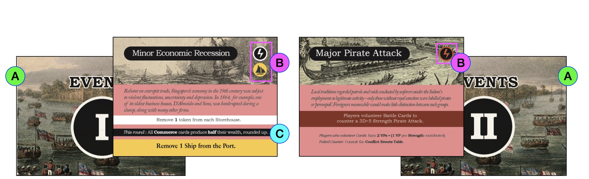

## Anatomy of an Event card

- **A. Card back.** Event I's happen before Event II's.
- **B. Instant effects.** These are immediately resolved from top to bottom upon revealing the Event.
> *Example.* Upon reveal of Minor Economic Recession, a token is removed from each Storehouse *(white text)*, then a Ship is removed from the Port *(yellow text)*.

| Symbol | Meaning |
| :---: | :---: |
|  | Resolve the **Event** / <strong>Conflict</strong>. See [Conflict Events Table](conflict-events-table). |
|  | Add or remove **Ships** from Port. |

- **C. Round modifiers.** These are highlighted in **black**, and remain in effect until the next Event card is revealed.