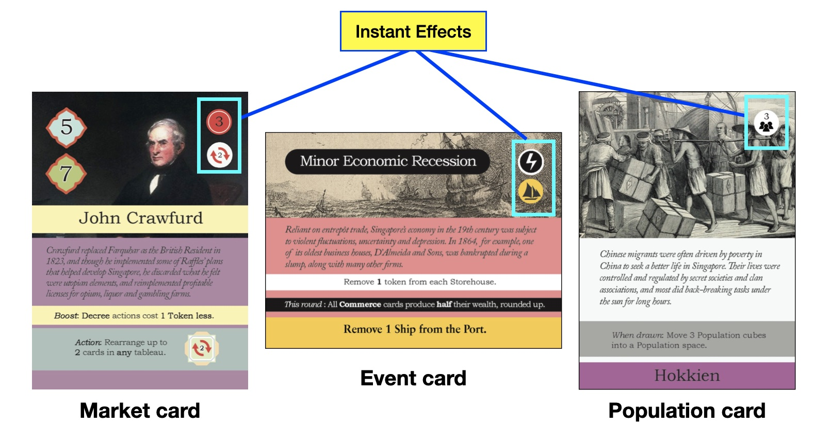

# Important Concepts
{: .no_toc }

Read these rules as needed during the game.

1. TOC
{:toc}

## Instant effects

Across card types, icons in the top right corner are **instant effects** that must be resolved from top to bottom, immediately upon reveal.

See [Icons Reference List](icons).

## Placing Influence

Starting at any open District or Storehouse, place 1 Influence token per space, going in the direction of the arrows. When you pass by **either** Storehouse, you may (but need not) place 1 Influence on it.

> *Example.* On the board above,
- 2 green Districts and 1 blue District are open.
- All other Districts are closed at the moment.
- The blue Storehouse has 4 Influence, while the green Storehouse has 3.

>  You are the <strong>Pink</strong> Malay Raja. You Activate the above Community for a total of 4 Influence: 2 from Naraina Pillai and 2 from Courthouse.

> You must now place 4 Influence tokens.
- You choose to place the 1st token on the first green District.
- Following the arrows, you place the 2nd token on the second green District.
- You opt to place the 3rd token in your own Storehouse.
- Finally, you must place the 4th token in the open blue District.

Remember: when Activating a Community, **sum up all Influence gained** before placing on the board!

### Scoring Districts
{: .no_toc }

When a District contains at least 5 Influence tokens at the end of an Influence placement, the District is immediately scored as follows:

1. Check the District's color. Agents only score VPs from blue Districts, while Rajas only score VPs from green Districts.
2. If you are eligible, count how many of **your** tokens are on the District. Gain **(District Multiplier)** VPs per token.
3. Clear the District of all tokens. Return tokens to players.
4. If the District has a ship icon, add a Ship to the Port.

> *Example, continued.* After placing Influence, the second green District now has 5 tokens.
- The Rajas --- here, the <strong>Blue</strong> and <strong>Pink</strong> players --- are eligible to score.
- The District multiplier is \\(\times 2\\), so the <strong>Blue</strong> player gains 2 VPs, and the <strong>Pink</strong> player receives 6 VPs.
- The Yellow player is an Agent and receives nothing.

## Placing Population

Populate your faction's Districts by placing Population cubes in the **leftmost** available box below. Filling these boxes unlock higher-scoring Districts. When a District is unlocked, move the black marker to cover the next circle on the Multiplier track.

> *Example.* The Malay faction has 7 Population cubes, while the British have 5.
- The Malay faction has unlocked their second green district.
- The active Multiplier is \\(\times 1\\).

> You are the <strong>Red</strong> player (British). You take the Populate Action and draw the Orang Laut, giving you 2 Population cubes.
- You place the 1st cube in the leftmost British Population box, filling it and unlocking your second District.
- You move the marker to the Multiplier track. The active Multiplier is now \\(\times 2\\).
- You place the 2nd cube on the next box.

### Losing Population
{: .no_toc }

When Population is lost, remove cubes starting from the **right**. When a box is no longer filled, the District above it closes. Move the black marker back from the Multiplier track, and discard any Influence tokens on the District.

## Excess Public Works
Each Public Work in excess of the Tax tokens must either be **Funded** or **Closed** by its owner.

### Funding a Public Work
{: .no_toc }

To **Fund** a Public Work, pay **$1 \\(\times\\) Upkeep Multiplier**, where the Upkeep Multiplier is the leftmost open value on the Multiplier track.

> *Example.* There are 4 Tax tokens and 6 Public Works tokens, so Upkeep is failed. The <strong>Blue</strong> and <strong>Pink</strong> players each have 1 excess Public Work.  Both players decide to **Fund** their Public Works by paying $1 \\(\times\\) Upkeep Multiplier of 2 = $2.

### Closing a Public Work
{: .no_toc }

When Public Works are unfunded, their physical structures --- while still standing --- must be shuttered, and the workers tending to its functions must leave.

To **Close** a Public Work:
1. Flip any one Public Works card in your tableau face down.
2. Remove the unfunded token from the Public Works track.
3. Discard any attached Population cards.
4. Remove the corresponding number of Population cubes from the board.

A face-down Public Work cannot be Activated. If the Public Work was part of a Community, the Community is divided.

> *Example.* Your tableau had one Community, consisting of G.D. Coleman, School, and Resident.
- During Upkeep, you were unable to fund your School.
- So you flip the card over and discard the Population card and player tokens.
- You also remove one Public Work token from the track.
- G.D. Coleman and Resident are now standalone cards.

### Rebuilding a Public Work
{: .no_toc }

On your turn, you may **Rebuild** a Public Work by paying its cost as a Free Action. 
- Rebuilding restores discarded **Public Work tokens** and repairs broken **Community connections**.
- However, Rebuilding does **not** restore lost Population.

## Moving cards

### Population cards
{: .no_toc }

With **one move**, you can move a Population card to any vacant Population slot in the same tableau.

### Market and Leader cards
{: .no_toc }

You can move Market and Leader cards that are **standalone** or **at the edge of a Community**. With **one move**, you can:
- Connect a standalone card to a Community.
- Separate a card from a Community.
- Separate a card from one Community and connect it to another.

In this case,Population cards move with the card they are attached to.

Cards cannot move *between* tableaus. One move must be completed before the next one can begin. You may make fewer moves than specified, or opt not to move any card.

> *Example.* You have a Community of three cards and one standalone card in your tableau. You may move any card except School. With 1 move, you can:
- Connect Sports Day (together with Orang Laut) to G.D. Coleman; or
- Separate the Resident from School; or
- Separate the Resident from School and connect him to Sports Day; or
- Move Orang Laut from Sports Day to Resident.

## Personality and Commerce cards

- Personality cards are Market cards with a purple background.
- Commerce cards are Market cards with **two red hollow** Connectors.

> *Example.* 
- Lieutenant-Governor and Daeng Ibrahim are Personality cards.
- Land Holdings is a Commerce card.
- Neither of these are Commerce cards: Daeng Ibrahim (Connectors not hollow) and Godowns (Connectors not both red).

## Resources
- If Market and Population decks run out, they remain empty.
- If Battle decks run out, shuffle discarded Battle cards and create a new deck.
- If Player tokens, Population cubes, or money run out, use suitable replacements.
