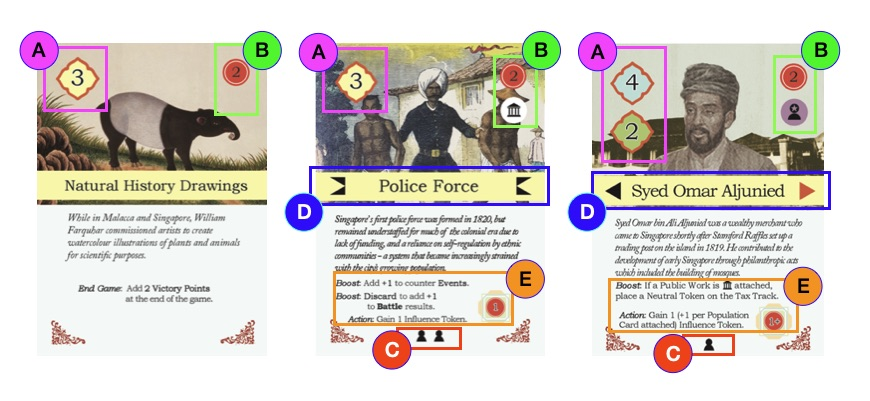
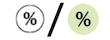
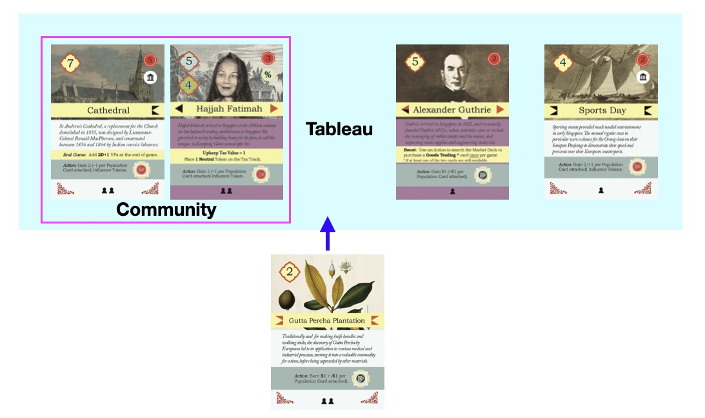
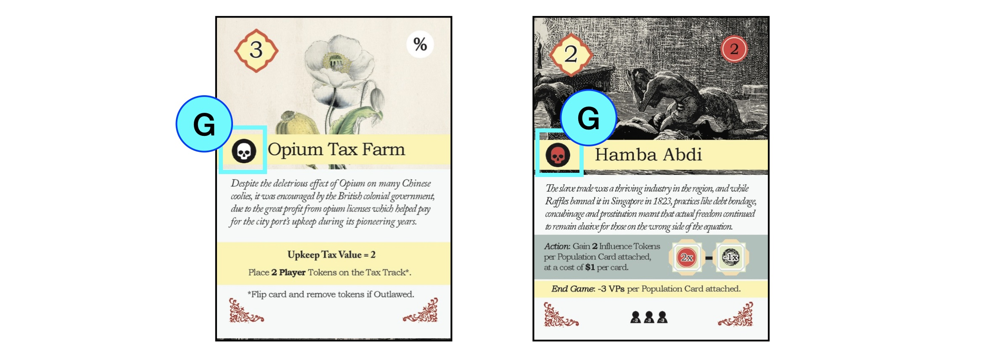

1. TOC
{:toc}

## Buy Market card

Buy one available card from the Market, then:

1. Resolve any instant effects;
2. Add the card to your Tableau, making at most one connection; then
3. Shift all face-up cards to the right, and draw the top card of the Market deck to fill the leftmost space.

## Anatomy of a Market card
{: .no_toc }

- **A. Price.** Some cards have distinct prices for British Agents (blue) and Malay Rajas (green).
> *Example.* Natural History Drawings and Police Force cost $3 for all players. Syed Omar Aljunied costs Agents $4, but Rajas only $2.
- **B. Instant effects.** These are resolved from top to bottom upon purchase of the card.
> *Example.* Upon purchase of Police Force, add 2 Influence to the board, then add one Player token to the Public Works track.

| Symbol | Meaning |
| :---: | :---: |
|  | Place *n* **Influence** tokens on Districts. See [Placing Influence](important-concepts#placing-influence). |
|  | **Move** *n* cards in **your own** / <strong>any player's</strong> Tableau. See [Moving cards](important-concepts#moving-cards). |
|  | Gain *x* amount of **Wealth**. |
|  | **Public Works** card: Add Player token to Public Works track. See [Perform Upkeep](sequence-of-play#4-perform-upkeep). |
|  | **Tax** card: Add *n* **Player** / <strong>Neutral</strong> tokens to Tax track. See [Perform Upkeep](sequence-of-play#4-perform-upkeep). |
|  | **Special Action** as described on card. |

- **C. Population slots.** Cards with Population symbols can accommodate Population cards. Some Actions depend on the number of Population cards attached.

> *Example.* Syed Omar Aljunied can accommodate one Population card, while Police Force can accommodate two.

- **D. Connectors.** Connectors allow cards to be organized into Communities, powerful groups of cards that can be Activated all at once.

Connections can be made between Connectors with **opposite shapes** and **identical colors**. When you buy a Market card, make up to 1 valid connection.

> *Example.* You have 4 cards in your Tableau:
- Cathedral and Hajjah Fatimah are connected.
- Alexander Guthrie and Sports Day *could have been* connected, using Guthrie's left Connector.

> You buy Gutta Percha Plantation.
- It can connect with *either* Hajjah Fatimah or Alexander Guthrie.
- However, you must choose only **one** connection to make.

To make, break, or change connections after purchase, use [the Move action](important-concepts#moving-cards).

- **E. Actions, Boosts and End Game bonuses.**
    - **Actions** are triggered whenever a card is Activated, and are described using the same iconography as Immediate Effects. See [Activate](activate).
    - **Boosts** are passives or special modifiers that take effect as soon as the card is bought.
    - **End Game bonuses** provide additional ways to earn VPs once the game ends.

- **F. Skull icons.** Market cards with skull icons are Vice or Slavery cards, and can be outlawed by Decrees.

| Symbol | Meaning |
| :---: | :---: |
|  | **Vice** / <strong>Slavery</strong> card: Can be outlawed. See [Decree](decree).  |

## Buy Battle card

Pay **$2** to draw the top card of your faction's Battle deck. Keep Battle cards hidden in your hand. 

## Anatomy of a Battle card
{: .no_toc }

- **A. Card back.** British Battle cards have blue backs, while Malay Battle cards have green backs.
- **B. Strength.** Card strengths range from 0 to 9.
- **C. Mythic symbol.** Mythic Battle cards with this symbol can only be used in Fantasy Mode.
- **D. Reveal Boost.** As a Free Action, reveal your Battle card and add it to your tableau. The Reveal Boost remains in effect so long as the Battle card is in your tableau.