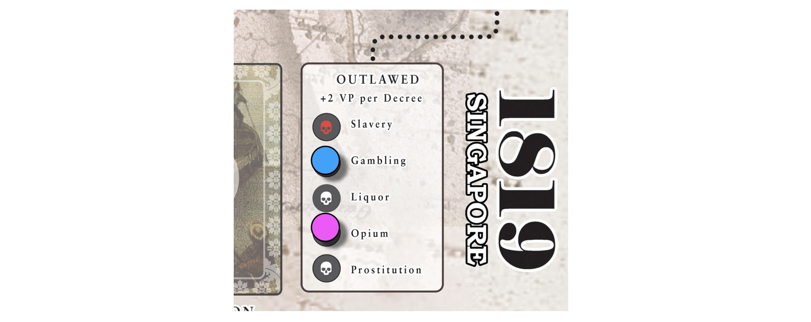

## Decree

Spend any 5 tokens from your Storehouse to **outlaw** or **legalize** a Vice. At the start of the game, all Vices are legal. Vices may be outlawed and legalized repeatedly.

The exception is **Slavery**, which costs 8 tokens to outlaw, and cannot be legalized thereafter.

> *Example.* Gambling and Opium are outlawed, while Slavery, Liquor, and Prostitution are legal.

### Outlaw
When you outlaw a Vice:
1. Place your Player token on the corresponding Vice tracker.
2. Flip over all such Vice cards in all players' tableaus.
3. Remove the corresponding tokens from the Tax track.
<!-- 4. Discard all such Vice cards, if any, from the Market. -->

### Legalize
When you legalize an outlawed Vice:
1. Remove the Player token from the corresponding Vice tracker.
2. Flip back all face-down Vices of that type.
3. Place tokens back on the Tax track.