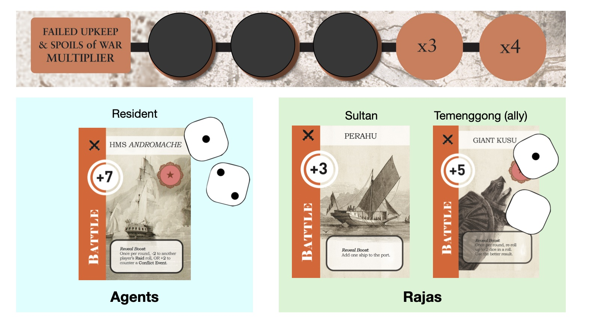

## Declare War

As the **Attacker**, spend any 7 tokens from your Storehouse to Declare War on a single player in the opposing faction (the **Defender**).

After the Anglo-Dutch Treaty, the cost of War drops to 4 tokens.

**War counts as 2 Actions.** It occurs in 4 stages:

1. Faction allies may volunteer to **Join** the War.
2. Attacker and Defender may each accept up to **one ally's help**.
3. Each player involved in War commits up to one Battle card.
4. The Attacker and Defender each roll 2 dice, then reveal any face-down Battle cards.

Whoever has the higher total Strength **(die roll + faction Battle card/s)** wins!

## The Aftermath

Discard all used Battle cards. **Remove $1D Ship(s) from the Port.**

The victor may **take the loser's Wealth** and/or **gain Victory Points** up to a maximum of **Total Strength difference \\(\times\\) Spoils of War Multiplier**.

> *Example.* The Resident attacks the Sultan. The Temenggong comes to the Sultan's aid.
- The Temenggong already has a Giant Kusu face up. He commits this card to the War.
- The Resident rolls a 3 and reveals HMS Andromache, for Total Strength of 10.
- The Sultan rolls a 1, reveals Perahu, and adds Giant Kusu, for Total Strength of 9.
- The Resident wins with Total Strength difference of \\(10 - 9 = 1\\).
- The Spoils of War Multiplier is 3.

> So the Resident may take up to $3 from the Sultan, gain up to 3 VPs, or some combination of both. He chooses to demand $1 and gain 2 VPs.

If the victor chooses to share the spoils with their ally, they must give their ally either \\(\frac{2}{3}\\) or \\(\frac{1}{3}\\) of the total.

The loser's ally may choose to absorb some of the monetary losses. Neither is required.

<!-- > **3-player game: the solo player may commit 2 battle cards.** -->